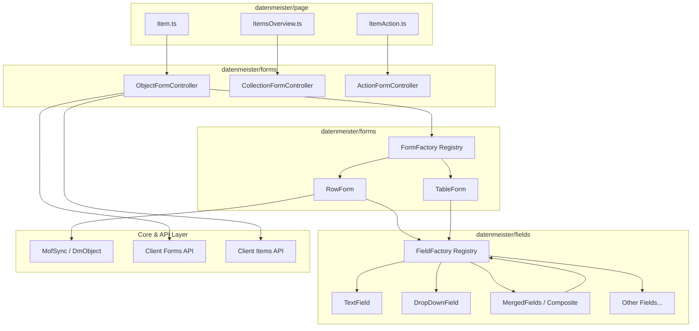

# Requirements

### Overview & Goals
The frontend form creation architecture in `Assets/js/datenmeister/forms/`, `Assets/js/datenmeister/fields/`, and `Assets/js/datenmeister/page/` handles rendering of dynamic forms generated from MOF metamodels (RowForm, TableForm, ObjectForm, CollectionForm, ActionForm). 

The goal of this architectural improvement is to:
1. **Unify and Decouple Configuration & Context**: Separate static form options (e.g. `isReadOnly`, `submitName`) from runtime form execution context (e.g. `workspace`, `extentUri`, `itemUrl`, `pageNavigation`, `viewMode`).
2. **Standardize Field Factory & Lifecycle**: Replace imperative property injection on fields with a clean constructor/context model, fix registry resolution bugs in `FieldFactory.ts`, and provide standard lifecycle methods (`createDom`, `evaluateDom`, `destroy`).
3. **Streamline Page Orchestration**: Clarify boundaries between page-level coordinators in `Assets/js/datenmeister/page/`, form controllers (`ObjectFormCreatorForItem`, `CollectionFormCreator`), and pure form renderers (`RowForm`, `TableForm`).
4. **Improve Type Safety & Maintainability**: Eliminate `any` casts, duplicate parameter structures, and redundant state tracking across the form rendering pipeline.

---

### Scope

#### In Scope
- **Interfaces & Types**: `IFormConfiguration`, `IFormContext`, `IFormField`, `IFieldRenderContext`, `IPageNavigation`, `IFormNavigation`.
- **Field Implementations**: All 18 field types in `Assets/js/datenmeister/fields/` and `FieldFactory.ts`.
- **Form Renderers & Factories**: `FormFactory.ts`, `RowForm.ts`, `TableForm.ts`, `CollectionForm.ts`, `ActionForm.ts`, `ObjectForm.ts`.
- **Page Coordinators**: `page/Item.ts`, `page/ItemsOverview.ts`, `page/ItemAction.ts`, `page/Actions.ts`, `page/ActionPure.ts`.

#### Out of Scope
- Server-side C# form creation plugins or API endpoints (except ensuring full contract compatibility).
- Changes to MOF metamodel definitions (`_DatenMeister._Forms.*`).
- UI styling overhaul (CSS/Bootstrap classes remain intact).

---

### User Stories
- **As a Developer adding a new Field Type**, I want to register a field factory class in `FieldFactory` with a single call and receive a typed `IFieldRenderContext`, so that I do not need to manually modify a switch-case or inject instance properties post-construction.
- **As a Developer building a new Page or Action View**, I want a clear, consistent entry-point API to mount object or collection forms into DOM containers without duplicating view mode resolution, breadcrumb initialization, and error handling.
- **As an End User**, I want forms to reliably render, validate, and synchronize MOF objects without UI glitches or orphaned field containers.

---

### Functional & Architectural Requirements
- **Unified Context Passing**: Runtime context (`workspace`, `itemUrl`, `extentUri`, `viewMode`, `pageNavigation`) must be passed down hierarchically through a dedicated context object rather than mutating instance properties.
- **Clean Field Registry**: `FieldFactory` must support both built-in field types and dynamically registered custom field types via a `Map<string, FieldConstructor>`, fixing the bug where custom registrations are overridden by `UnknownField`.
- **Consistent Field Lifecycle**: Fields must implement a standard lifecycle: instantiation with context -> `createDom(dmElement)` -> `evaluateDom(dmElement)` -> optional teardown.
- **Strict Separation of Concerns**:
  - `page/*.ts`: Entry points that extract URL query parameters, bind DOM container elements, and initialize page controllers.
  - `forms/*Creator.ts`: Page controllers that orchestrate data/form loading, view mode selection, breadcrumbs, and switching between View and Edit modes.
  - `forms/*Form.ts`: UI components responsible for rendering and DOM event handling.
  - `fields/*.ts`: Atomic UI controls responsible for individual property visualization and editing.

# Technical Design

### Current Implementation & Identified Issues

#### 1. Inconsistent Configuration vs. Context
Currently, `IFormConfiguration` mixes three different responsibilities:
- **Presentation Options**: `isReadOnly`, `submitName`, `showCancelButton`, `allowAddingNewProperties`.
- **Runtime Identifiers / Metamodel**: `formElement`, `formType`, `formUri`, `viewMode`.
- **Lifecycle Callbacks**: `onSubmit`, `onCancel`, `refreshForm`.

In many places (e.g. `ObjectFormCreatorForItem.rebuildForm`), configurations are constructed with missing required properties and patched incrementally:
```typescript
// Current pattern: ad-hoc mutation
let configuration = { isReadOnly: true };
configuration.formType = FormType.Object;
configuration.viewMode = await VML.getDefaultViewModeIfNotSet(...);
```

#### 2. Imperative Property Injection on Fields (`FieldFactory.ts`)
Fields are instantiated parameterless and mutated imperatively:
```typescript
// Current pattern in FieldFactory.ts
let result = new TextField.Field();
result.configuration = parameter.configuration;
result.isReadOnly = parameter.isReadOnly;
result.field = parameter.field;
result.itemUrl = parameter.itemUrl;
result.form = parameter.form;
```
Furthermore, `FieldFactory.ts` has a registry lookup bug in the `default:` branch:
```typescript
for (var n in registeredFieldContainers) {
    if (registeredField.metaClassFieldData === fieldMetaClassUri) {
        result = registeredField.factoryMethod();
    }
}
result = new UnknownField.Field(fieldMetaClassUri); // OVERWRITES registered result!
```

#### 3. Dual Responsibilities in Controllers and Form Classes
- `ObjectFormCreatorForItem` handles DOM wiring, query parameter reading, breadcrumbs, view mode selection, API loading, and edit/view mode toggling.
- `TableForm` spans over 800 lines implementing both `ICollectionForm` and `IObjectForm`, mixing DOM caching, context menu management, server query creation, sorting, and inline editing.

---

### Key Architectural Decisions

1. **Split `IFormConfiguration` into `IFormContext` and `IFormOptions`**:
   - `IFormContext`: Immutable runtime execution context (`workspace`, `itemUrl`, `extentUri`, `viewMode`, `pageNavigation`, `formElement`).
   - `IFormOptions`: Display and behavioral options (`isReadOnly`, `isNewItem`, `submitName`, `showCancelButton`, `allowAddingNewProperties`, callbacks).
2. **Introduce `IFieldRenderContext` and Standardize Field Constructors**:
   - Fields receive their configuration, field definition, item URL, form reference, and read-only status at creation time or via a typed context parameter.
3. **Refactor `FieldFactory` & `FormFactory` into Typed Registry Maps**:
   - Replace the large switch statement and broken fallback loop with a `Map<string, IFieldFactory>` supporting built-in and pluggable field handlers.
4. **Standardize Page Initialization Patterns**:
   - All `page/*.ts` modules follow a unified setup pattern: parse parameters -> create page controller with typed container anchors -> execute lifecycle `init()`.

---

### Architecture Diagram



---

### Data Models & Refactored Contracts

#### 1. Form Options & Context Contracts (`forms/Interfaces.ts` & `forms/IFormConfiguration.ts`)
```typescript
export interface IFormOptions {
    isReadOnly: boolean;
    isNewItem?: boolean;
    allowAddingNewProperties?: boolean;
    submitName?: string;
    showCancelButton?: boolean;
    onCancel?: () => void;
    onSubmit?: (element: Mof.DmObjectWithSync, method: SubmitMethod) => Promise<void> | void;
    onFieldChanged?: (fieldName: string, value: any) => void;
}

export interface IFormContext {
    readonly workspace: string;
    readonly extentUri: string;
    readonly itemUrl: string;
    readonly viewMode: string;
    readonly formElement: Mof.DmObject;
    readonly pageNavigation?: IPageNavigation;
    refreshForm: () => Promise<void>;
}
```

#### 2. Field Render Context & Interface (`fields/Interfaces.ts`)
```typescript
export interface IFieldRenderContext {
    readonly fieldDefinition: Mof.DmObject;
    readonly formContext: IFormContext;
    readonly options: IFormOptions;
    readonly isReadOnly: boolean;
    readonly itemUrl: string;
}

export interface IFormField {
    readonly context: IFieldRenderContext;
    createDom(dmElement: Mof.DmObject): Promise<JQuery<HTMLElement>>;
    evaluateDom(dmElement: Mof.DmObject): Promise<void>;
    showNameField?(): boolean;
    showValue?(): boolean;
    callbackUpdateField?: () => void;
    destroy?(): void;
}
```

#### 3. Field Factory Map Registry (`forms/FieldFactory.ts`)
```typescript
export type FieldFactoryMethod = (context: IFieldRenderContext) => IFormField;

class FieldRegistry {
    private readonly registry = new Map<string, FieldFactoryMethod>();

    register(metaClassUri: string, factory: FieldFactoryMethod): void {
        this.registry.set(metaClassUri, factory);
    }

    create(context: IFieldRenderContext): IFormField {
        const metaClassUri = context.fieldDefinition.metaClass?.uri ?? "";
        const factory = this.registry.get(metaClassUri);
        if (factory) {
            return factory(context);
        }
        return new UnknownField.Field(context);
    }
}
```

---

### File Structure & Changes Overview

| Module / Path | File | Proposed Changes |
| :--- | :--- | :--- |
| `forms/` | `IFormConfiguration.ts` | Split into `IFormOptions` and `IFormContext`. Keep backwards-compatible type aliases. |
| `forms/` | `Interfaces.ts` | Clean up `IForm`, `IPageForm`, `IObjectForm`, `ICollectionForm` with strict context typing. |
| `forms/` | `FieldFactory.ts` | Replace switch/case with `Map`-based registry; fix custom field overwrite bug. |
| `forms/` | `FormFactory.ts` | Consolidate decoupled, object, and collection form registries into typed factory maps. |
| `forms/` | `ObjectForm.ts` | Separate `ObjectFormController` (page logic) from `ObjectFormRenderer` (tab rendering). |
| `forms/` | `RowForm.ts` | Accept `IFormContext` and `IFormOptions`, cleanly manage field lifecycle and change events. |
| `forms/` | `TableForm.ts` | Modularize context menus, query execution, and column rendering with typed parameters. |
| `forms/` | `CollectionForm.ts` | Use unified context and clean delegation to table/collection renderers. |
| `forms/` | `ActionForm.ts` | Streamline action execution, element creation, and form rendering through unified context. |
| `fields/` | `Interfaces.ts` | Update `IFormField` and `BaseField` to accept `IFieldRenderContext` in constructor. |
| `fields/` | `*.ts` (All 18 fields) | Update constructors and `createDom`/`evaluateDom` to use `this.context`. |
| `page/` | `Item.ts`, `ItemsOverview.ts`, `ItemAction.ts` | Standardize DOM anchor configuration and controller initialization. |

---

### Risks & Mitigations

| Risk | Impact | Mitigation Strategy |
| :--- | :--- | :--- |
| Breaking changes in custom/plugin field registrations | Custom plugins fail to render fields | Maintain backwards compatibility by allowing factory methods taking legacy parameter formats while encouraging `IFieldRenderContext`. |
| Regression in complex fields (`MergedFieldsInCell`, `CompositeField`) | Nested form components fail to propagate values | Add recursive context passing and verify nested DOM evaluation tests. |
| State desynchronization during View/Edit mode switching | Incomplete DOM sync when toggling modes | Ensure `MofSync.sync` and form rebuild lifecycle cleanly flush pending changes before switching mode. |

# Testing

### Validation Approach
Verification of the refactored form architecture will be performed through structured TypeScript build validation, unit testing of field/form factories, and end-to-end form rendering scenario checks.

---

### Key Scenarios

#### 1. Field Creation & Registry Resolution
- **Built-in Field Types**: Verify that all standard field types (TextField, CheckboxField, DateTimeField, DropDownField, ReferenceField, SubElementField, MergedFieldsInCell, ActionField) resolve and render correctly through `FieldFactory`.
- **Custom / Plugged Field Registration**: Register a custom field metaclass URI in `FieldFactory` and verify it is returned without being overwritten by `UnknownField`.
- **Unknown Field Fallback**: Verify that unregistered field metaclass URIs produce an `UnknownField` indicator without throwing unhandled exceptions.

#### 2. RowForm & ObjectForm Rendering
- **Single and Multi-Tab Object Forms**: Verify rendering of single-tab and multi-tab object forms with various field combinations.
- **View vs. Edit Mode**:
  - In View Mode, fields render read-only representations (labels, uneditable values, copy-to-clipboard if configured).
  - In Edit Mode, fields render inputs (textboxes, textareas, dropdowns, checkboxes).
  - Switching from Edit to View Mode saves changes via `onSubmit` and triggers `MofSync.sync`.
- **Merged Fields in Cell**: Verify merged field containers render multi-action buttons (e.g. Excel Import buttons) and respect individual field predicates.

#### 3. CollectionForm & TableForm Operations
- **Root Elements View**: Verify `ItemsOverview.ts` renders extent collections with pagination, column sorting, and filtering.
- **Metaclass Creation Action**: Verify "Create new item with MetaClass" dropdown opens, populates metaclasses, and navigates to the item creation form.
- **Inline Editing & Context Menus**: Verify table row context menu actions function and update underlying MOF objects.

#### 4. ActionForm & Client Actions
- **Empty Object Action Form**: Verify `ItemAction.ts` creates temporary element, renders action form, and executes action with client action handling upon submission.

---

### Edge Cases & Regressions to Check
- **Empty or Null Metaclass URI**: Ensure `getDefaultObjectForMetaClass` and `FieldFactory` handle undefined/null metaclass gracefully.
- **Nested Composite Fields**: Ensure changes inside nested `MergedFieldsInCell` and `CompositeField` propagate to parent form `evaluateDom`.
- **Rapid Mode Switching**: Ensure fast toggling between ViewMode and EditMode does not leave stale DOM nodes or trigger concurrent sync conflicts.
- **URL Parameter Edge Cases**: Verify correct decoding of query parameters (`metaclass`, `workspaceId`, `viewMode`, `formUri`) on all page entry points.

# Delivery Steps

### * Step 1: Refactor Interfaces, Contexts, and Registries
Form and field interfaces, options, and factory registries are refactored with strong typing and unified context structures.

- Define `IFormContext` and `IFormOptions` to cleanly separate execution context (workspace, itemUri, extentUri, pageNavigation, viewMode) from form display options (isReadOnly, submitName, isNewItem, callbacks).
- Define `IFieldRenderContext` and update `IFormField` / `BaseField` to accept context in constructor/initialization rather than ad-hoc property injection.
- Refactor `FieldFactory.ts` to use a robust `Map<string, FieldConstructor | FieldFactoryMethod>` registry, fixing the registry lookup override bug in default case and removing the hardcoded switch.
- Refactor `FormFactory.ts` into a unified typed form registry for Object, Collection, and Decoupled form types.

###   Step 2: Update Field Components to New Interface Model
Individual field implementations in `Assets/js/datenmeister/fields/` are updated to conform to the new `IFormField` interface and lifecycle.

- Update basic input fields (`TextField`, `CheckboxField`, `DateTimeField`, `DropDownField`, `DropDownBaseField`, `DropDownByCollection`, `DropDownByQuery`).
- Update reference and object fields (`ReferenceField`, `MetaClassElementField`, `SubElementField`, `UriReferenceFieldData`, `AnyDataField`).
- Update composite and structural fields (`CompositeField`, `MergedFieldsInCell`, `SeparatorLineField`, `ActionField`, `UnknownField`) to pass `IFieldRenderContext` down to nested child fields.
- Ensure consistent DOM value evaluation (`evaluateDom`) and change propagation (`callbackUpdateField`) across all field types.

###   Step 3: Refactor Form Renderers and Component Layouts
Form renderers (`RowForm`, `TableForm`, `CollectionForm`, `ActionForm`) are refactored to focus purely on rendering and layout, decoupling them from page-level URL routing.

- Refactor `RowForm.ts` to consume `IFormContext` and `IFormOptions`, delegating field creation through the updated `FieldFactory`.
- Refactor `TableForm.ts` to separate table rendering/DOM cache from collection querying and state management (`TableState`).
- Standardize `ActionForm.ts` and `CollectionForm.ts` form initialization patterns using the unified `IFormContext`.
- Normalize form submission and sync handling (`MofSync.sync`) across all form components.

###   Step 4: Refactor Page Orchestrators and Controller Bindings
Page-level controllers in `Assets/js/datenmeister/page/` and high-level form controllers in `Assets/js/datenmeister/forms/` are streamlined with consistent initialization.

- Refactor `ObjectFormCreatorForItem` and `CollectionFormCreator` to act as pure page/controller coordinators connecting DOM container elements to form renderers.
- Modernize page entry points (`page/Item.ts`, `page/ItemsOverview.ts`, `page/ItemAction.ts`) to use a consistent builder/initialization pattern with typed HTML element container mappings.
- Clean up test/debug page handlers in `page/Actions.ts` and `page/ActionPure.ts`.
- Verify full end-to-end integration across view modes, edit flows, action forms, and breadcrumbs.