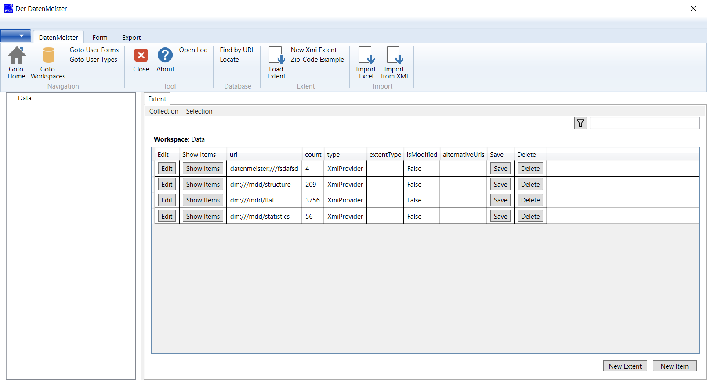

== How to use DatenMeister ==

Execute DatenMeister.exe... It will load. 

===	Tree view ===

The tree view gives a hierarchical overview of the elements within an extent. 

When the user clicks on the root node, the children of the extent themselves will be shown. 

When the user clicks on an element, the children of the elements are shown in the extent view. When the user doubleclicks an element, the details of the clicked element are opened.

===	List View === 
The list view shows all direct child items of the selected extent or a selected container within the tree view. 

The user can create a new element out of the list view. The element is added into the selected extent, if the root element in tree view is selected. Otherwise the element will be added to the selected package. 

If the user has selected an element within the tree view, the user is requested to define the property to which the new element will be added. 

=== Detail view === 

When the user clicks upon an object to show its information, the detail view is generated.

For each element, a detail view is automatically generated. This generator of the detail view performs the following actions: 

. Check, whether the element to be shown is a typed element, containing property definitions. 
. If there are no property definitions, the properties of the elements are enumerated

The content of the property definition defines the type of each row item: 

- Booleans will be shown as checkmarks
- Integer are shown as small textboxes
- Other types are shown as large textboxes
